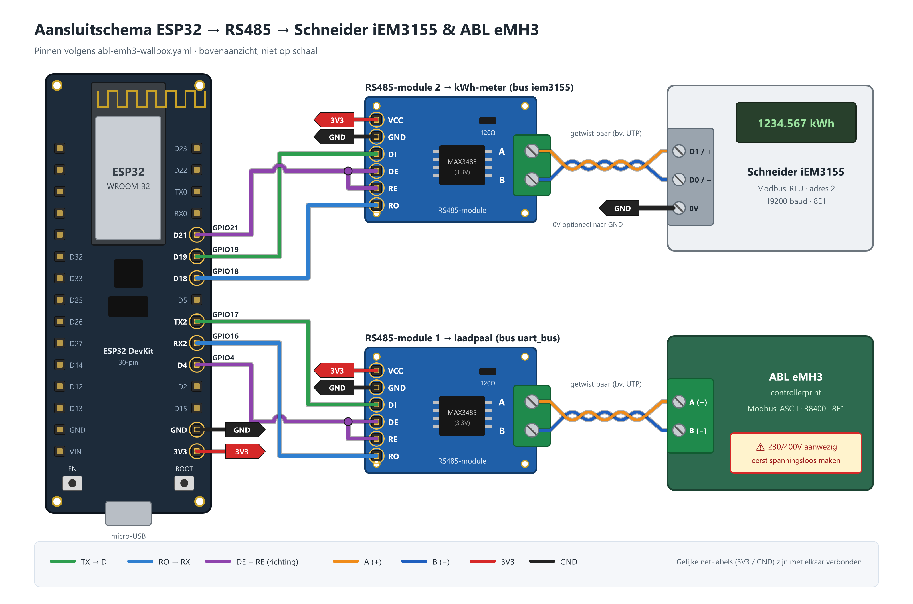

# ABL eMH3 + Schneider iEM3155 (ESP32, 2× RS485)

Voorbeeldconfiguratie voor een ABL eMH3 laadpaal (Modbus-ASCII) en een Schneider iEM3155 kWh-meter (Modbus-RTU) op één ESP32, elk op een eigen RS485-bus.



| Bestand | Inhoud |
|---|---|
| [abl-emh3-wallbox.yaml](abl-emh3-wallbox.yaml) | ESPHome-configuratie |
| [aansluitschema.png](aansluitschema.png) / [.svg](aansluitschema.svg) | Aansluitschema ESP32 → RS485 → meter + laadpaal |
| [ABL-eMH3-iEM3155-handleiding.docx](ABL-eMH3-iEM3155-handleiding.docx) | Handleiding: benodigdheden, pintabel, stappenplan, probleemoplossing |
| [tools/](tools) | Scripts waarmee het schema en de handleiding zijn gegenereerd |

## Bedrading

| ESP32 | RS485-module 1 (ABL) | RS485-module 2 (iEM3155) |
|---|---|---|
| GPIO17 (TX) | DI | – |
| GPIO16 (RX) | RO | – |
| GPIO4 | DE + RE | – |
| GPIO19 (TX) | – | DI |
| GPIO18 (RX) | – | RO |
| GPIO21 | – | DE + RE |
| 3V3 / GND | VCC / GND | VCC / GND |

Module A/B → ABL A(+)/B(−) en iEM3155 D1(+)/D0(−). Gebruik 3,3V RS485-modules (bv. MAX3485/SP3485).

`secrets.yaml` heeft nodig: `wifi_ssid`, `wifi_password`, `ap_fb_pw`, `api_encryption_key`, `ota_password`.

## Schema en handleiding opnieuw genereren

```bash
cd tools
npm install
cd ..
node tools/make_schema.js
node tools/make_doc.js
```
